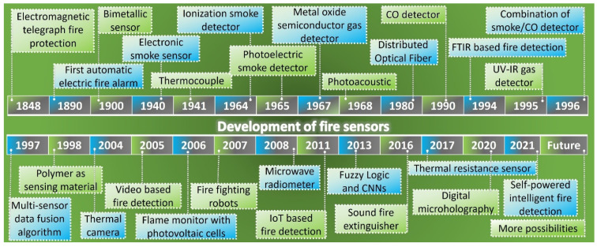
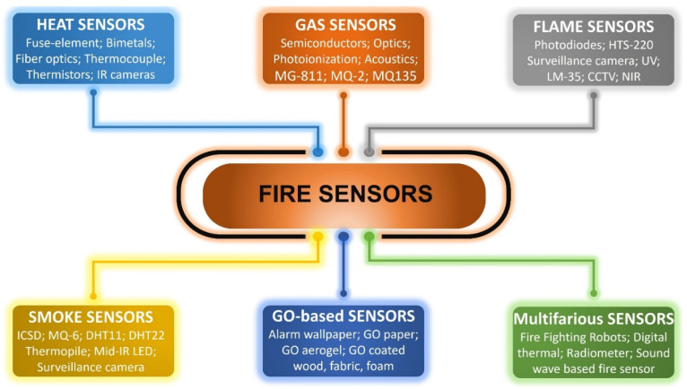

# Fire Sensors







## Heat Sensors

The sensors are sensitive to the temperature that is related to the resistance variation, displacement, and refractive index.<br>
Generally, there are three types of heat sensors: fixed temperature, increase rate, and compensation rate. <br>

1. fixed temperature: <br>
The fixed temperature heat sensor is triggered when the temperature rises above the threshold value, which is at or above 60 °C
    - fuse-element <br>
        The fuse-element type heat sensor operates at a set temperature level based on the melting of the heating element and is mainly used in the fire sprinkler system.
    - bimetals <br>
        The bi-metal heat sensor works according to the mechanism of thermal expansion of the metals. When the temperature rises, the bimetallic strip will bend to the metal with a low coefficient of thermal expansion.
        - electrical <br>
            Electronic type heat detectors operate with a thermoelectric effect, which uses one or two thermistors to detect the temperature
        - sheathed thermocouples <br>
            sheathed thermocouple heat sensors work according to the principle of change in the wire resistance and surface temperature 
        - optical <br>
            The heat sensor is built with a minimal working temperature or a threshold temperature environment. The rate of compensation heat sensor is enabled when the air temperature is higher than the fixed temperature
    - distributed fiber optics. <br>
        With heat the fiber optics cable starts to melt and expand, creating a difference in the reflected light.
     
2. increase rate
3. compensation rate

## Gas Sensors

Gases are emitted at every stage of combustion, and unique gas characteristics can be used to reliably detect fires.<br>
 identified the density of ```CO, CO2, H2, O2```, and smoke produced by wood fire, cotton fire, plastic fire, liquid n-heptane and spirit fires. The chemical composition of smoke from various types of fires varies radically, according to their source. `CO is the best of the four warning gases, appearing in all six types of fires.` CO fire sensors that work at room temperature, require a low-power source in comparison to traditional detectors and can protect against smoldering fire, including the combustion of organic materials in which substantial amounts of carbon dioxide are emitted early in the combustion process. <br>
``` to view CO sensor``` 

## Smoke Sensors 
1. non-visual <br>
    Smoke measurement technology based on photoelectric is specifically used for smoldering and can detect fire more quickly. The smoke is measured by the ionization level of the air by an ionization smoke sensor. The detection is done by creating a potential difference between the chambers and measuring the current that results.
    
2. visual


